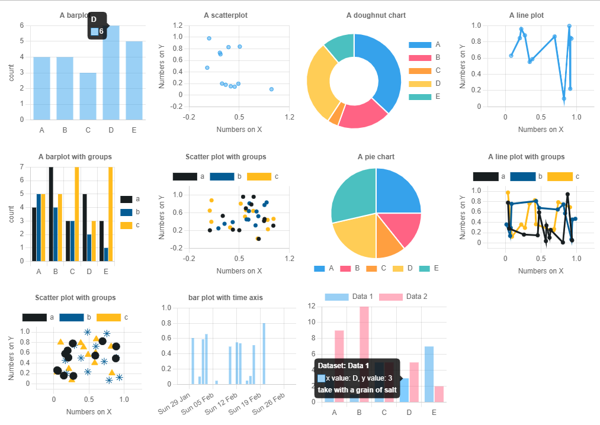
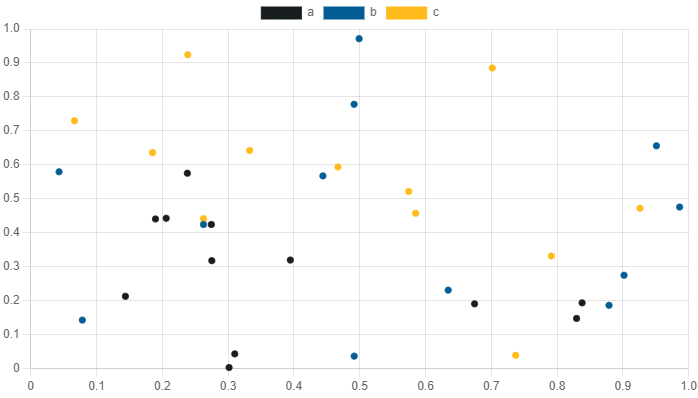

<!-- README.md is generated from README.Rmd. Please edit that file -->

```{r, include = FALSE}
knitr::opts_chunk$set(
  collapse = TRUE,
  comment = "#>",
  fig.path = "man/figures/README-",
  out.width = "100%",
  eval = T
)

on_github <- knitr::pandoc_to() == 'gfm'
not_github <- !on_github
```

# chartjs4r

<!-- badges: start -->

[](https://github.com/Shaunson26/chartjs4R/actions/workflows/check-standard.yaml)
[](https://github.com/Shaunson26/chartjs4R/actions/workflows/test-coverage.yaml)
<!-- badges: end -->

An implementation of [chartjs](https://www.chartjs.org/) for R.  

> Still in it's infancy .. still working out the API and function logic

So far including

 - chart types - bar (+stack, +horizontal), scatter (+line), doughnut/pie
 - axis scales - numeric, category, time ...
 - shape/colour/size scales
 - theme control
 - add plugins
 - basic shiny
 - tools tips 
 - still much todo ... more shiny



## Installation

``` r
# install.packages("devtools")
devtools::install_github("Shaunson26/chartjs4R")
```

``` r
library(chartjs4r)
```

```{r, include = FALSE}
devtools::load_all()
```

## Examples

> See `vignette(package = 'chartjs4r')` 'live' and deeper examples ... only screenshots are presented for the GitHub README ..

Inputs can be a list of `options` as initialized in chartjs javascript, or a
data.frame. The latter of which this package essentially builds the former.

### A list of chartjs options

```{r}
cjs_list_input_example()
```

<!--700x400 save-->
```{r, eval = not_github}
cjs_list_input_example() %>% 
  chartjs()
```

```{r, eval = on_github, echo = FALSE}
knitr::include_graphics('man/figures/cjs_list_input_example_plot.png')
```

### Barplots

```{r, out.width='100%', eval = not_github}
cjs_example_data('bar') %>%
  chartjs(type = 'bar', x = letters, y = numbers) %>% 
  cjs_scale_cartesian(id = 'y', title.text = 'count',
                      ticks = cjs_ticks(callback = ticks_integer_callback(step = 1))) %>% 
  cjs_scale_category(id = 'x',
                     grid = cjs_grid(display = FALSE)) %>% 
  cjs_theme(title.text = 'A Chart.js plot', legend.position = 'none')
```

```{r, eval = on_github, echo = FALSE}
knitr::include_graphics('man/figures/cjs-barplot-1.png')
```

If you have a groups column

```{r, out.width='100%', eval = not_github}
# includes a group column
cjs_example_data('bar', grouped = TRUE) %>%
  chartjs(type = 'bar', x = letters, y = numbers, group = group)
```

```{r, eval = on_github, echo = FALSE}
knitr::include_graphics('man/figures/cjs-barplot-by-group.png')
```

Or chain things

```{r, out.width='100%', eval = not_github}
cjs_example_data('bar') %>%
  chartjs() %>% 
  cjs_add_bars(x = letters, y = numbers, label = 'from source data') %>% 
  cjs_add_bars(x = LETTERS[1:5], y = 5:1, label = 'from vectors') %>% 
  cjs_add_bars(x = x1, y = y1, label = 'from given data', 
               data = data.frame(x1 = LETTERS[1:5], y1 = rpois(5,5))) %>% 
   cjs_scale_color(backgroundColors = c('#181E20', '#045C94','#FFBB1C'))
```

```{r, eval = on_github, echo = FALSE}
knitr::include_graphics('man/figures/cjs-barplot-2.png')
```

### Scatter plots

```{r, out.width='100%', eval = not_github}
cjs_example_data('scatter') %>%
  chartjs(type = 'scatter', x = x_numbers, y = y_numbers) %>% 
  # fix documentation of these
  cjs_scale_cartesian(id = 'y', title.text = 'Numbers on Y',
                      min = -0.2, max = 1.2) %>% 
  cjs_scale_cartesian(id = 'x', title.text = 'Numbers on X',
                      min = -0.2, max = 1.2)
```

```{r, eval = on_github, echo = FALSE}
knitr::include_graphics('man/figures/cjs-scatterplot-1.png')
```

```{r, out.width='100%', eval = not_github}
cjs_example_data('scatter') %>%
  chartjs() %>% 
  cjs_add_points(x = x_numbers, y = y_numbers, label = 'a') %>% 
  cjs_add_points(x = runif(12), y = runif(12), label = 'b') %>% 
  cjs_add_points(x = x1, y = y1, label = 'c', data = data.frame(x1 = runif(12), y1 = runif(12))) %>% 
  cjs_scale_color(backgroundColors = c(a = '#181E20', b = '#045C94', c = '#FFBB1C'), match_background_and_border = T)
```

```{r, eval = on_github, echo = FALSE}

```

### Doughnut and pie charts

```{r, out.width='100%', eval = not_github}
cjs_example_data('doughnut_pie') %>%
  chartjs() %>% 
  cjs_add_doughnut_pie(type = 'doughnut', x = letters, y = numbers)
```

```{r, eval = on_github, echo = FALSE}
knitr::include_graphics('man/figures/cjs-doughtnut-1.png')
```

```{r, out.width='100%', eval = not_github}
cjs_example_data('doughnut_pie') %>%
  chartjs() %>% 
  cjs_add_doughnut_pie(type = 'pie', x = letters, y = numbers)
```

```{r, eval = on_github, echo = FALSE}
knitr::include_graphics('man/figures/cjs-pie-1.png')
```

### Tool tips

Using text literals in `cjs_tooltip()`

```{r, out.width='100%', eval = not_github}
chartjs() %>%
  cjs_add_bars(x = letters, y = numbers, label = 'Data 1', data = cjs_example_data('bar')) %>% 
  cjs_add_bars(x = letters, y = numbers, label = 'Data 2', data = cjs_example_data('bar')) %>% 
  cjs_tooltip(label = 'x value: ${x}, y value: ${y}', 
              title = 'Dataset: ${label}', 
              footer = 'same for all')
```

```{r, eval = on_github, echo = FALSE}
knitr::include_graphics('man/figures/cjs-tooltips.png')
```

What are shown on the in the tool tip using `cjs_interaction_mode()`

```{r, out.width='100%', eval = not_github}
cjs_example_data('bar', grouped = TRUE, shuffle = TRUE) %>% 
  chartjs(type = 'bar', x = letters, y = numbers, group = group) %>% 
  cjs_interaction_mode('index') %>% 
  cjs_tooltip(title = 'All data in ${x}')
```

```{r, eval = on_github, echo = FALSE}
knitr::include_graphics('man/figures/cjs-interaction-mode.png')
```


