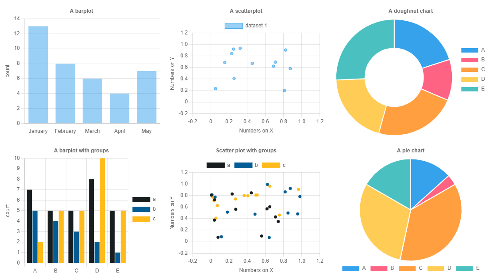
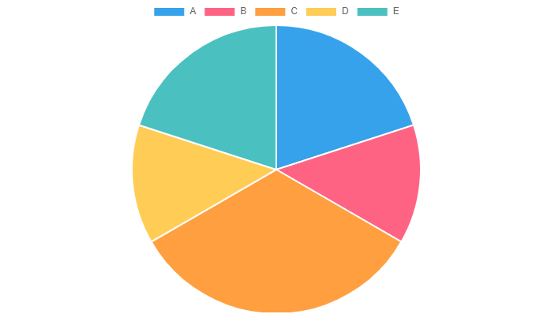

<!-- README.md is generated from README.Rmd. Please edit that file -->

```{r, include = FALSE}
knitr::opts_chunk$set(
  collapse = TRUE,
  comment = "#>",
  fig.path = "man/figures/README-",
  out.width = "100%",
  eval = F
)
```

# chartjs4r

<!-- badges: start -->

[](https://github.com/Shaunson26/chartjs4R/actions/workflows/check-standard.yaml)
[](https://github.com/Shaunson26/chartjs4R/actions/workflows/test-coverage.yaml)
<!-- badges: end -->

An implementation of [chartjs](https://www.chartjs.org/) for R.  

> Still in it's infancy



## Installation

``` r
# install.packages("devtools")
devtools::install_github("Shaunson26/chartjs4R")
```

``` r
library(chartjs4r)
```

```{r, eval = TRUE, include = F}
devtools::load_all()
```

## Examples

> See `vignettes/chart-examples.Rmd` `vignettes/list-usage.Rmd` for deeper examples

Inputs can be a list of `options` as initialized in chartjs javascript, or a
data.frame. The latter of which this package essentially builds the former.

### A list of chartjs options

```{r, eval = TRUE}
cjs_list_input_example()
```

<!--700x400 save-->
```{r}
cjs_list_input_example() %>% 
  chartjs()
```


### Barplots

```{r, out.width='100%'}
cjs_example_data('bar') %>%
  chartjs(type = 'bar', x = letters, y = numbers) %>% 
  cjs_scale_cartesian(id = 'y', title.text = 'count',
                      ticks = cjs_ticks(callback = ticks_integer_callback(step = 1))) %>% 
  cjs_scale_category(id = 'x', labels = month.name[1:5],
                     grid = cjs_grid(display = FALSE)) %>% 
  cjs_theme(title.text = 'A Chart.js plot', legend.position = 'none')
```


```{r, out.width='100%'}
cjs_example_data('bar') %>%
  chartjs() %>% 
  cjs_add_bars(x = letters, y = numbers, label = 'from source data') %>% 
  cjs_add_bars(x = LETTERS[1:5], y = 5:1, label = 'from vectors') %>% 
  cjs_add_bars(x = x1, y = y1, label = 'from given data', 
               data = data.frame(x1 = LETTERS[1:5], y1 = rpois(5,5))) %>% 
   cjs_scale_color(backgroundColors = c('#181E20', '#045C94','#FFBB1C'))
```


### Scatter plots

```{r, out.width='100%'}
cjs_example_data('scatter') %>%
  chartjs(type = 'scatter', x = x_numbers, y = y_numbers) %>% 
  # fix documentation of these
  cjs_scale_cartesian(id = 'y', title.text = 'Numbers on Y',
                      min = -0.2, max = 1.2) %>% 
  cjs_scale_cartesian(id = 'x', title.text = 'Numbers on X',
                      min = -0.2, max = 1.2)
```


```{r, out.width='100%'}
cjs_example_data('scatter') %>%
  chartjs() %>% 
  cjs_add_points(x = x_numbers, y = y_numbers, label = 'a') %>% 
  cjs_add_points(x = runif(12), y = runif(12), label = 'b') %>% 
  cjs_add_points(x = x1, y = y1, label = 'c', data = data.frame(x1 = runif(12), y1 = runif(12))) %>% 
  cjs_scale_color(backgroundColors = c(a = '#181E20', b = '#045C94', c = '#FFBB1C'), match_background_and_border = T)
```


### Doughnut and pie charts

```{r, out.width='100%'}
cjs_example_data('doughnut_pie') %>%
  chartjs() %>% 
  cjs_add_doughnut_pie(type = 'doughnut', x = letters, y = numbers)
```


```{r, out.width='100%'}
cjs_example_data('doughnut_pie') %>%
  chartjs() %>% 
  cjs_add_doughnut_pie(type = 'pie', x = letters, y = numbers)
```


